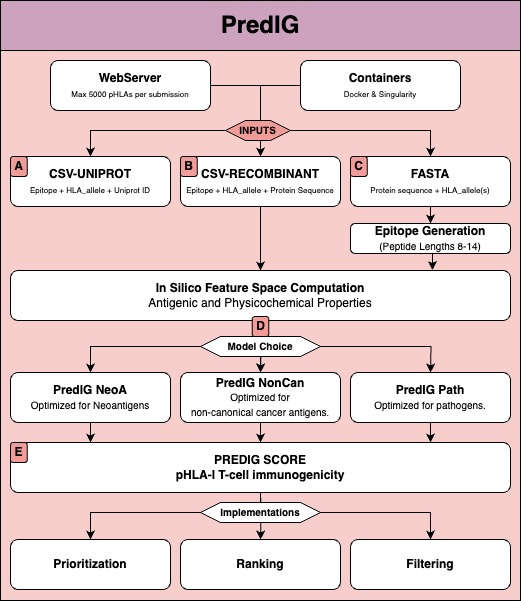

# PredIG: an interpretable predictor of T-cell epitope immunogenicity

Roc Farriol-Duran<sup>1,2</sup>*, Christian Dominguez-Dalmases<sup>1</sup>, Albert Cañellas-Solé<sup>1</sup>,Miguel Vázquez<sup>1</sup>, Eduard Porta-Pardo<sup>1,2</sup>, Víctor Guallar<sup>1,3</sup>ª
1. Barcelona Supercomputing Center (BSC), 08034 Barcelona, Spain.
2. Josep Carreras Leukaemia Research Institute (IJC), Badalona, Spain
3. Institució Catalana de Recerca i Estudis Avançats (ICREA), Barcelona, Spain

\* First author <br>
ª Corresponding author <br>
For scientific or usage enquires refer to: roc.farriol@bsc.es and/or victor.guallar@bsc.es

### Abstract
Cytotoxic T cells are key effectors in the immune response against pathogens and cancer. Hence, their activation, driven by the recognition of immunogenic epitopes, consitutes a coveted goal for immunotherapies. However, the epitope landscape, both in cancer and infection, is too large to test due to the immense number of candidates versus the high cost and low throughput of experimental techniques. Enabling larger throughtputs, immunoinformatic models prioritize the candidates with greater potential but their success rate has remained incremental and their explainability limited. Here we present PredIG, a predictor of T-cell epitope immunogenicity that integrates antigenic and physicochemical properties of 17448 pHLA-I using XGBoost, a decision-tree-based algorithm that boosts explainability. PredIG outperforms state-of-the-art methods in two pathogen and non-canonical cancer antigen held-out sets. In cancer neoantigens, PredIG increases the success rate of binding affinity predictions and identifies alternative immunogenic epitopes. Our XAI scheme pinpoints the importance of antigenic and physicochemical epitope properties and their differences in each antigen type. Overall, PredIG can increase the immunogenicity success rates in vaccine design for cancer and infection and displays an unprecedented interpretability to build community trust. Plus, its containerized environments and a user-friendly webserver grant PredIG's accessibility at https://horus.bsc.es/predig

### Graphical Abstract


### Usage Scheme
PredIG usage modes in a user-friendly webserver implementation (https://horus.bsc.es/predig) and in containerized environments for high-throughput reproducibility in HPC environments (https://github.com/BSC-CNS-EAPM/predig-containers/).

<p align="center">
    
</p>

**Exploration Modes (Inputs)**  <br>
A) **"CSV-Uniprot” mode**: input a .CSV file with pairs of peptide and HLA-I allele and the Uniprot ID of the corresponding parental protein. <br>
B) **"CSV-Recombinant" mode**: input a .CSV file with pairs of peptide and HLA-I allele and the amino acid sequence of the protein of origin. This mode is designed to support (recombinant) proteins without Uniprot ID but can also work with any protein sequence. <br>
C) **"FASTA" mode**: input a FASTA file with the target protein sequence and a .CSV file with a list of HLA-I alleles of interest ("HLA_allele" column). By default, PredIG will generate all possible epitopes of 8 to 14 AA of length and will calculate against the input HLA-I alleles. <br>

**PredIG Model Selection: antigen-type specific** <br>
D) The user can choose between three PredIG predictive models: PredIG-NeoA optimized for cancer neoantigens, PredIG-Non-Can for non-canonical cancer antigens and PredIG-Path for pathogen antigens. E) PredIG's output is a CSV with one pHLA-I per row containing PredIG score and all the predictors in PredIG feature space. <br>

Find PredIG's models in the data folder of this repo.  <br>

### Datasets
Find PredIG's train, test and held-out datasets in the data folder of this repo. <br>
These include: <br>
- predig_train_modf.csv > PredIG train set <br>
- predig_test_modf.csv > PredIG test set for model validation. <br>
- predig_i1_modf.csv > PredIG held-out for cancer neoantigen generalization assessment. i1 refers to Independent 1. <br>
- predig_i2_modf.csv > PredIG held-out for non-canonical cancer antigen generalization assessment. i2 refers to Independent 2. <br>
- predig_i3_modf.csv > PredIG held-out for pathogen generalization assessment. Contains epitopes from SARS-CoV-2. i3 refers to Independent 3. <br>


### Tutorial
PredIG uses XGBoost tunning to optimize its performance and adapt to different data sources. The main goal was to optimize the model to foster the scoring of epitopes in extreme class imbalance conditions where few immunogenic candidates are expected among many immune silent epitopes. Thus, we provide different models for the user to select the expected class imbalance in their target data. See PredIG Model Selection section. <br>

Find the scripts to run PredIG in the scripts folder of this repo and see each runner.txt for detailed information on command-line parameters. <br>

#### PREDIG PIPELINE 1
Input 1: CSV with epitope, HLA_allele, uniprot_id columns.

Runner example for cancer neoantigens <br>
```r
Rscript scripts/predig_pipe1_container.R --input path/to/input1.csv --out path/to/your/out/directory --model neoant --exp_name your_experiment1
```

Runner example for non-canonical cancer antigens. <br>
```r
Rscript scripts/predig_pipe1_container.R --input path/to/input1.csv --out path/to/your/out/directory --model noncan --exp_name your_experiment2
```

Runner example for epitopes derived from pathogens. <br>
```r
Rscript scripts/predig_pipe1_container.R --input path/to/input1.csv --out path/to/your/out/directory --model path --exp_name your_experiment3
```

#### PREDIG PIPELINE 2
Input 2: CSV with epitope, HLA_allele, protein_seq and protein_name columns <br>

```r
Rscript scripts/predig_pipe2_container.R --input path/to/input2.csv --out path/to/your/out/directory --model neoant --exp_name your_experiment4
Rscript scripts/predig_pipe2_container.R --input path/to/input2.csv --out path/to/your/out/directory --model noncan --exp_name your_experiment5
Rscript scripts/predig_pipe2_container.R --input path/to/input2.csv --out path/to/your/out/directory --model path --exp_name your_experiment6
```
#### PREDIG PIPELINE 3
Input 3: FASTA with single protein and CSV with HLA-I alleles in 4-digits resolution. Ie: HLA-A*02:01 or HLA-A*01:101 <br>

```r
Rscript scripts/predig_pipe3_container.R --fa path/to/input3.fasta --a path/to/alleles3.csv --model neoant --exp_name your_experiment7
Rscript scripts/predig_pipe3_container.R --fa path/to/input3.fasta --a path/to/alleles3.csv --model noncan --exp_name your_experiment8
Rscript scripts/predig_pipe3_container.R --fa path/to/input3.fasta --a path/to/alleles3.csv --model path --exp_name your_experiment9
```

### Output Format

Your Results file is a CSV that contains the following columns: <br>

| ID | epitope | HLA_allele | PredIG | NOAH | NetCleave | Hydrophobicity_peptide | MW_peptide | Charge_peptide | Stab_peptide | TCR_contact | Hydrophobicity_tcr_contact | MW_tcr_contact | Charge_tcr_contact |
|----|---------|------------|--------|------|-----------|------------------------|------------|----------------|--------------|-------------|---------------------------|----------------|---------------------|

**PredIG score**: Find it at column "PredIG". Briefly, PredIG score consists of a probability from 0 to 1, being 1 the maximum likelihood for epitope immunogenicity. This score can be used to rank candidates for prioritization approaches or to classify them using adaptable thresholds. <br>

#### Antigenic Features
| Feature Name | Predicted Process | Scoring Range (Interpretation) | Reference (DOI) |
|--------------|-------------------|--------------------------------|-----------------|
| NOAH | HLA-I peptide binding (structural) | Likelihood for binding probability from negative to positive, being negative best.<br><-1 Binders<br><-5 Strong Binders | 10.1186/s12967-023-04843-8 |
| NetCleave | C-terminal Cleavage for Proteasomal Antigen Processing | Probability score for C-terminal processing by the proteasome. From 0 to 1, being 1 best.<br>>= 0.6 Processed peptides.<br>>= 0.8 Optimally processed peptides. | NetCleave v2.0: 10.1007/978-1-0716-3239-0_15<br><br>NetCleave v1.0: 10.1038/s41598-021-92632-y |

### Physicochemical Features
**Full Epitope**: Calculated for the entire epitope sequence. <br>
| Feature Name | Predicted Process | Scoring Range (Interpretation) | Reference (DOI) |
|--------------|-------------------|--------------------------------|-----------------|
| Hydrophobicity_peptide | Epitope Hydrophobicity | The hydrophobicity index is calculated adding the hydrophobicity of individual amino acids and dividing this value by the length of the sequence. Highly expected transmembrane peptides generally have higher hydrophobicity values than 0.5 using KyteDoolittle scale. | 10.32614/RJ-2015-001 |
| MW_peptide | Molecular Weight.<br>Proxy for amino acid bulkiness. | The molecular weight is the sum of the masses of each atom constituting a molecule. The molecular weight is directly related to the length of the amino acid sequence and is expressed in daltons (Da). | 10.32614/RJ-2015-001 |
| Charge_peptide | Net electric charge. | The net sum of the charges of each of the amino acids comprised in the peptide. | 10.32614/RJ-2015-001 |
| Stability_peptide | Peptide (in)stability in solution. | This index predicts the stability of a protein based on its amino acid composition. |10.32614/RJ-2015-001 |

**TCR Contact Region**: Calculated for the central residues of the epitope. These are reported to interact directly with the TCR CDR loops. 
Includes amino acids from position 4 to Omega -2 of the epitope sequence.

| Feature Name | Predicted Process | Scoring Range (Interpretation) | Reference (DOI) |
|--------------|-------------------|--------------------------------|-----------------|
| Hydrophobicity_tcr_contact | Hydrophobicity (P4 - PO-2) | Hydrophobicity calculated as for the full peptide but exclusively against the central residues of the epitope. | 10.32614/RJ-2015-001 |
| MW_tcr_contact | Molecular Weight (P4-PO-2) | Molecular Weight calculated as for the full peptide but exclusively against the central residues of the epitope. |10.32614/RJ-2015-001 |
| Charge_tcr_contact | Net charge (P4-PO-2) | The net sum of the charges of each of the amino acids comprised in the central region of the peptide |10.32614/RJ-2015-001 |


